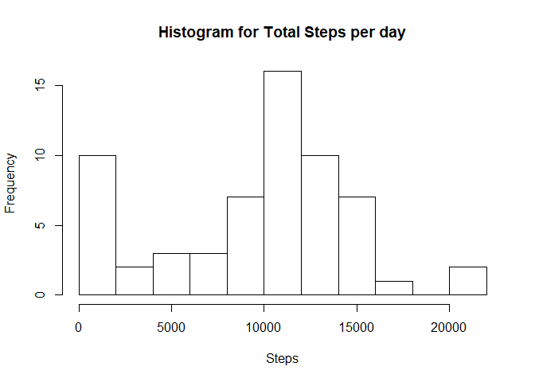
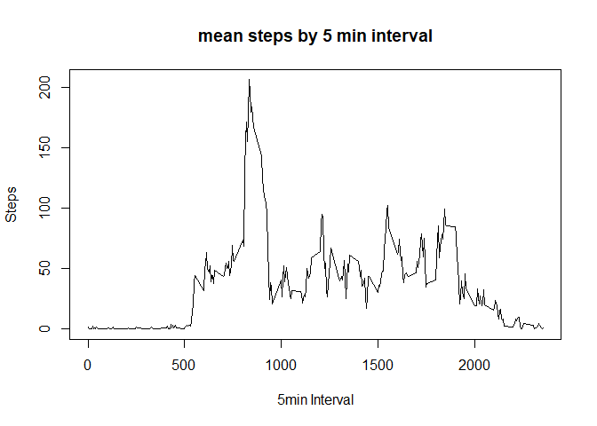
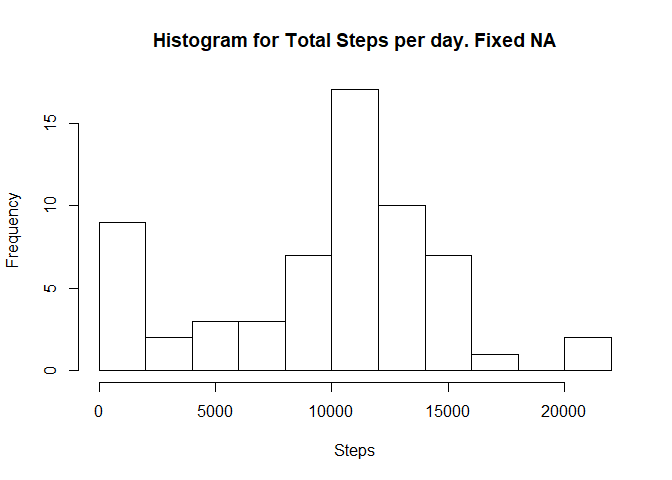
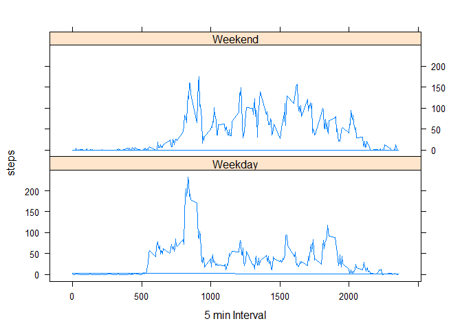

1. Loading and preprocessing the data
-------------------------------------

Data is loaded to a dataframe d1 Dates are not set on date class format.
Column is transformed.

    d1<-read.csv("activity.csv")
    d1$date<-as.Date(d1$date, "%Y-%m-%d")

2. What is mean total number of steps taken per day?
----------------------------------------------------

NA data is ignored for calculation

-1 Calculate the total number of steps taken per day

It is calculated as array t1

-2 Make a histogram of the total number of steps taken each day

-3 Mean and Median are reported using summary

Mean 9354 Median 10395

    t1<-tapply(d1$steps, d1$date, sum, na.rm=TRUE)
    hist(t1,main="Histogram for Total Steps per day",xlab="Steps", breaks = 10)

    summary(t1)

    ##    Min. 1st Qu.  Median    Mean 3rd Qu.    Max. 
    ##       0    6778   10395    9354   12811   21194

3. What is the average daily activity pattern?
----------------------------------------------

-1 Make a time series plot (i.e. type = "l") of the 5-minute interval
(x-axis) and the average number of steps taken, averaged across all days
(y-axis)

-2 Which 5-minute interval, on average across all the days in the
dataset, contains the maximum number of steps?

Interval 835 , Mean 206

    m1<-tapply(d1$steps, d1$interval, mean, na.rm=TRUE)
    m1x<-unique(d1$interval)

    plot(m1x,m1,type = "l",xlab = "5min Interval", ylab = "Steps", main = "mean steps by 5 min interval")

    m2<-m1[which(m1[]==max(m1))]
    m2

    ##      835 
    ## 206.1698

Imputing missing values
-----------------------

-1 Calculate and report the total number of missing values in the
dataset (i.e. the total number of rows with NAs)

The number is reported as m3 = 2304

-2 Devise a strategy for filling in all of the missing values in the
dataset. The strategy does not need to be sophisticated. For example,
you could use the mean/median for that day, or the mean for that
5-minute interval, etc.

The mean of the 5 minute interval is used to fill the NAs

-3 Create a new dataset that is equal to the original dataset but with
the missing data filled in.

New dataset is labeled d2

-4 Make a histogram of the total number of steps taken each day and
Calculate and report the mean and median total number of steps taken per
day. Do these values differ from the estimates from the first part of
the assignment? What is the impact of imputing missing data on the
estimates of the total daily number of steps?

There is a little increase in the mean value, 9531 vs 9354. Up 2%

    m3 <- sum(is.na(d1))
    s1 <- d1$steps
    count=1
    while (count <= length(s1)) {
            if(is.na(s1[count])==TRUE){s1[count]<-m1[count]}
            count=count+1
    }

    d2<-d1
    d2$steps<-s1

    t1<-tapply(d2$steps, d2$date, sum, na.rm=TRUE)
    hist(t1,main="Histogram for Total Steps per day. Fixed NA",xlab="Steps", breaks = 10)

    summary(t1)

    ##    Min. 1st Qu.  Median    Mean 3rd Qu.    Max. 
    ##       0    7047   10439    9531   12811   21194

Are there differences in activity patterns between weekdays and weekends?
-------------------------------------------------------------------------

-1 Create a new factor variable in the dataset with two levels -
"weekday" and "weekend" indicating whether a given date is a weekday or
weekend day.

-2 Make a panel plot containing a time series plot (i.e. type = "l") of
the 5-minute interval (x-axis) and the average number of steps taken,
averaged across all weekday days or weekend days (y-axis). See the
README file in the GitHub repository to see an example of what this plot
should look like using simulated data.

    s1<-d2$date
    s1<-weekdays(s1)
    count=1
    while (count <= length(s1)) {
            if(s1[count]=="Saturday" | s1[count]=="Sunday"){s1[count]<-"Weekend"}
            else{s1[count]<-"Weekday"}
            count=count+1
    }

    d2<-cbind(d2,s1)

    d3<-d2[which(s1=="Weekday"),]
    d4<-d2[which(s1=="Weekend"),]

    m1<-tapply(d3$steps, d3$interval, mean, na.rm=TRUE)
    m2<-tapply(d4$steps, d4$interval, mean, na.rm=TRUE)
    m1<-rep(m1,5)
    m2<-rep(m2,2)
    m<-c(m1,m2)
    m<-rep(m,8)
    m<-c(m,m1)
    d2<-cbind(d2,m)

    library(lattice)
    xyplot(d2$m ~ d2$interval | s1, layout = c(1,2), xlab = "5 min Interval",
           ylab="steps", type = "l")

